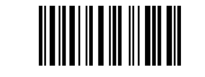

# Barcodes

A [Code128](https://en.wikipedia.org/wiki/Code_128) barcode generator (see also [The 128 code](http://grandzebu.net/informatique/codbar-en/code128.htm) and [How Barcodes Work](https://courses.cs.washington.edu/courses/cse370/01au/minirproject/BarcodeBattlers/barcodes.html)).

This package is under development and is not yet registered.

Currently, only code128 is being implemented, but other barcodes might be implemented in the future. Contributions are welcome!

## Methods

The main encoding methods are 

* `encode(msg::AbstractString, encoding_type::Symbol)`: yields a symbolic encoding for the given `msg`, in the form of a `Vector{String}`, according to the given `encoding_type`;
* `barcode_pattern(code::Vector{<:AbstractString}, encoding_type::Symbol)`: yields the barcode pattern for the given `code` (usually obtained from `encode()`), in the form of a `String` with 0's and 1's representing a space or a bar, according to the given `encoding_type`;
* `barcode_pattern(msg::AbstractString, encoding_type::Symbol)`: yields the codebar pattern directly from the `msg` (this simply calls the previous two methods), according to the given `encoding_type`.
* `barcode_img(pattern::String; img_height = 50)`: yields a `Gray` type barcode image associated with the given pattern.

The main decoding methods are
* `decode(code::Vector{String}, encoding_type::Symbol)`: yields the message encoded in `code`, according to the given `encoding_type`;
* `barcode_depattern(pattern::AbstractString, encoding_type::Symbol)`: yields the `code` associated with the given barcode pattern `pattern`, according to the given `encoding_type`;
* `barcode_decode(pattern::AbstractString, encoding_type::Symbol)`: yields the message encoded in the given barcode pattern `pattern`, according to the given `encoding_type`.

Currently, only Code128 is implemented, for which one should set `encoding_type` to `:code128`. When encoding, it is also possible to set the `encoding_type` to either `:code128a`, `:code128b`, or `:code128c`, following the subtypes Code128A, Code128B or Code128C, respectively.

If `:code128` is given, the method attempts to infer whether `code` can be encoded using `code128c` (only digits, with even length), `code128b`, or `code128a` subtypes, or it will then look for an optimized mixed-subtype encoding.

## Examples

### Zip code barcode

Here is an example with a ZIP code:

```julia
julia> using Barcodes

julia> zip_code = "12.345-678"
"12.345-678"

julia> zip_code = replace(zip_code, r"\s|\.|\-" => "")
"12345678"

julia> pattern = Barcodes.barcode_pattern(zip_code, :code128)
"00000000000110100111001011001110010001011000111000101101100001010010001110110110001110101100000000000"
```

One can see the code with `encode`:

```julia
julia> code = Barcodes.encode(zip_code, :code128)
7-element Vector{String}:
 "START C"
 "12"
 "34"
 "56"
 "78"
 "CHECKSUM"
 "STOP"
```

Once the `pattern` is obtained, one can create a Gray Image with `barcode_img(pattern::String; img_height = 50)`. After that, you can save it with `FileIO`.

```julia
julia> using FileIO

julia> img = Barcodes.barcode_img(pattern)

julia> FileIO.save("img/zipcode_img.png", img)
```

Here is the result of saving the zip code above to a PNG file with `Barcodes.barcode_img("img/zipcode_img.png", pattern)`:


With [JuliaImages](https://juliaimages.org/stable/), one can resize the generated image as desired.

One can also plot the barcode with `Plots`, using the utility function `Barcodes.barcode_positions(pattern)`, which yields the locations (indices) of each solid bar and their width:

```julia
julia> using Plots

julia> x, w = Barcodes.barcode_positions(pattern)([12, 15, 18, 23, 25, 29, 34, 38, 40, 45  …  56, 62, 64, 67, 71, 75, 78, 83, 87, 89], [2, 1, 3, 1, 2, 3, 1, 1, 2, 3  …  2, 1, 1, 1, 3, 2, 2, 3, 1, 2])

julia> plot([x'; x' + w'], ones(2, length(x)), color = :black, fill = true, xlims = (1, length(pattern)),  ylims = (0, 1), border = :none, legend = nothing)
```

Here is the resulting image:



One can decode it directly from the pattern or from the code, with

```julia
julia> code_back = Barcodes.barcode_depattern(pattern, :code128)
7-element Vector{String}:
 "START C"
 "12"
 "34"
 "56"
 "78"
 "CHECKSUM 47"
 "STOP"

julia> msg_back1 = Barcodes.decode(code_back, :code128) # from the depatterned code
"12345678"

julia> msg_back2 = Barcodes.barcode_decode(pattern, :code128) # directly from pattern
"12345678"
```

Another representation of the barcode is with the widths of the bars and of the spaces between bars. The `START C` code pattern `11010011100`, for instance, can also be represented by `211232`, which are the widths of each bar and each space, with the correspondance `11 => 2`, `0 => 1`, `1 => 1`, `00 => 2`, `111 => 3`, `00 => 2`. Each code pattern always starts with `1`, ends with `0`, and has exactly three bars and three spaces. We can get this alternative representation for the barcode with the method `barcode_widths(pattern::AbstractString)`.

```julia
julia> Barcodes.barcode_widths(pattern)
"211232112232131123331121241112133121233111"
```

### Barcode social preview image for Barcodes.jl

The image for the github social preview of this package was created from the barcode for "Barcodes.jl", with

```julia
julia> msg = "Barcodes.jl"
"Barcodes.jl"

julia> pattern = Barcodes.barcode_pattern(msg, :code128)
"00000000000110100100001000101100010010110000100100111101000010110010001111010100001001101011001000010011001110100001100101100101000011001101100110001110101100000000000"

julia> x, w = Barcodes.barcode_positions(pattern)
([12, 15, 18, 23, 27, 29, 34, 37, 39, 45  …  122, 126, 128, 133, 137, 140, 144, 149, 153, 155], [2, 1, 1, 1, 1, 2, 1, 1, 2, 1  …  2, 1, 1, 2, 2, 2, 2, 3, 1, 2])

julia> plot([x'; x' + w'], ones(2, length(x)), color = :black, fill = true, xlims = (1, length(pattern)),  ylims = (0, 1), border = :none, legend = nothing, size = (896, 448))

julia> savefig("img/barcodejl.svg")
```

We save the barcode plot to `SVG` and added the text and extra margins with [Inkspace](https://inkscape.org), adjusting the size to 1280 x 640.

### Mixed subtypes

Here is another example, with mixed subtypes:

```julia
julia> msg = "\x02abc1234\x03"
"\x02abc1234\x03"

julia> println(msg)
abc1234

julia> code = Barcodes.encode(msg, :code128)
13-element Vector{String}:
 "START A"
 "STX"
 "CODE B"
 "a"
 "b"
 "c"
 "CODE C"
 "12"
 "34"
 "CODE A"
 "ETX"
 "CHECKSUM"
 "STOP"

julia> pattern = Barcodes.barcode_pattern(code, :code128)
"00000000000110100001001001000011010111101110100101100001001000011010000101100101110111101011001110010001011000111010111101000010110011110010100110001110101100000000000"

julia> img = Barcodes.barcode_img(pattern)

julia> FileIO.save("img/abc1234.png", img)
```


## To do

- [ ] Encoding in Code128 is not yet complete. It needs to be able to handle the directive FNC4 to access iso-latin ISO/IEC 8859-1 characters.

- [ ] It can also be improved to generate GSM-128 encoding.

- [ ] Add Documentation and simplify README.

- [ ] Register the package.

- [ ] There are plenty of other barcode formats that can be implemented.

## License

This package is provided under the [MIT License](LICENSE).
